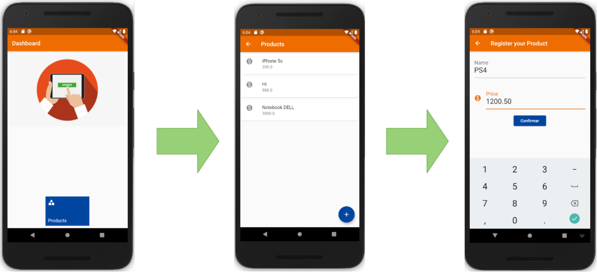

# Flutter APP - flutter_app

A new Flutter application.

## Getting Started

This project is a starting point for a Flutter application.

A few resources to get you started if this is your first Flutter project:

- [Lab: Write your first Flutter app](https://flutter.dev/docs/get-started/codelab)
- [Cookbook: Useful Flutter samples](https://flutter.dev/docs/cookbook)

For help getting started with Flutter, view our
[online documentation](https://flutter.dev/docs), which offers tutorials,
samples, guidance on mobile development, and a full API reference.

## Install 
Na documentação do [flutter](https://flutter.dev/docs/get-started/install) baixe o zip `fluuter_linux_v1***.tar.xz`. Você pode usar o tar para extrair em sua pasta de instalação:
```
tar xf ~/Downloads/flutter_linux_v1.9.1+hotfix.2-stable.tar.xz
```

Adicione o flutter/bin na variável PATH de ambiente.
`export PATH="$PATH:`pwd`/flutter/bin"`

Para Baixar os binarios necessarios para o flutter execute a comando abaixo:
```bash
flutter precache
```
#### Flutter doctor
Este comando exibe um checklist do seu ambiente:     
```bash
flutter doctor
```

## Instalando o Android Studio
https://flutter.dev/docs/get-started/editor

## Criando um Emulador
https://developer.android.com/studio/run/managing-avds#createavd


## Creating my first app

```bash
flutter create flutter_app
```

```bash
cd flutter_app
flutter run
``` 

Output: `No supported devices connected.`   
   

```bash
flutter devices
```

output:

```
No devices detected.   
   
Run 'flutter emulators' to list and start any available device emulators.   

Or, if you expected your device to be detected, please run "flutter doctor" to diagnose   
potential issues, or visit https://flutter.dev/setup/ for troubleshooting tips.   
```

```bash
flutter emulators
```
output:   
``` 
1 available emulator:

Nexus_5X_API_28 • Nexus 5X API 28 • Google • android

To run an emulator, run 'flutter emulators --launch <emulator id>'.
To create a new emulator, run 'flutter emulators --create [--name xyz]'.

You can find more information on managing emulators at the links below:
  https://developer.android.com/studio/run/managing-avds
  https://developer.android.com/studio/command-line/avdmanager
```

```bash
flutter emulators --launch Nexus_5X_API_28
flutter run
```   

## App



### Code Organization


```bash
├── flutter-app
         └── lib
              ├── main.dart
              ├── commons
              │       ├── components
              │       │       └── edit.dart
              │       └── screens
              │               └── dashboard.dart
              ├── database
              │       └── app_database.dart
              │
              └── product
                     ├── dao
                     │     └── product_dao.dart
                     ├── models
                     │     └── product.dart
                     └── screens
                           ├── form.dart
                           └── list.dart

```

Ref.:

https://flutter.dev/docs/get-started/test-drive
https://flutter.dev/docs/get-started/codelab   
https://material.io/resources/   
https://material.io/design/color/the-color-system.html#tools-for-picking-colors
https://medium.com/flutter-community/flutter-code-organization-de3a4c219149
https://cursos.alura.com.br/formacao-flutter
https://flutter.dev/docs/cookbook/persistence/sqlite
https://pub.dev/packages/http


